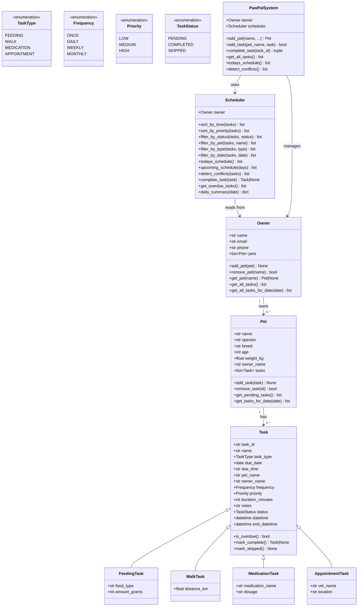

# 🐾 PawPal+ — Smart Pet Care Management System

PawPal+ is a Python application that helps pet owners track daily routines —
feedings, walks, medications, and vet appointments — while using algorithmic
logic to organise and prioritise tasks automatically.

---

## 📸 Demo

> Launch the app with `streamlit run app.py` and navigate to `http://localhost:8501`.

The UI includes five pages:
| Page | What it does |
|------|-------------|
| 🏠 Dashboard | Today's schedule, KPI metrics, conflict warnings, overdue alerts |
| 🐾 My Pets | Add / remove pets, view per-pet task lists |
| 📋 All Tasks | Filter, sort, and mark tasks complete or skipped |
| ➕ Add Task | Schedule Feeding / Walk / Medication / Appointment tasks |
| ⚙️ Settings | Update owner profile, reset demo data |

---

## 🏗️ Architecture

### UML Class Diagram



---

## ✨ Features

### Core OOP
- **Owner** — manages a household of pets and aggregates all tasks
- **Pet** — stores pet details and owns a personal task list
- **Task hierarchy** — base `Task` dataclass with four specialised subclasses
  (`FeedingTask`, `WalkTask`, `MedicationTask`, `AppointmentTask`)
- **Enumerations** — `TaskType`, `Frequency`, `Priority`, `TaskStatus` for
  type-safe state representation

### Smarter Scheduling

| Algorithm | Description |
|-----------|-------------|
| **Sort by Time** | `Scheduler.sort_by_time()` uses Python's `sorted()` with a `(due_date, due_time)` key for O(n log n) chronological ordering |
| **Sort by Priority** | `Scheduler.sort_by_priority()` sorts by `(-priority.value, date, time)` to surface HIGH-priority tasks first |
| **Filter** | `filter_by_status / filter_by_pet / filter_by_type / filter_by_date` — composable list comprehensions |
| **Conflict Detection** | O(n²) pairwise scan across pending tasks for the same pet on the same date, using time-window overlap: `start_a < end_b AND start_b < end_a` |
| **Recurring Tasks** | `Task.mark_complete()` returns a new `Task` instance scheduled via `timedelta` (daily +1d, weekly +7d, monthly +30d); the `Scheduler` automatically appends it to the pet |
| **Overdue Detection** | Any pending task whose `datetime` is before `datetime.now()` is flagged |
| **Daily Summary** | Returns a `dict` with total / pending / completed / conflicts / overdue counts for any given date |
| **7-Day Upcoming** | `Scheduler.upcoming_schedule(days=7)` pulls all pending tasks within a rolling window |

---

## 🗂️ Project Structure

```
pawpal/
├── pawpal_system.py   # Core logic layer (OOP + algorithms)
├── main.py            # CLI demo script
├── app.py             # Streamlit UI
├── tests/
│   ├── __init__.py
│   └── test_pawpal.py # 30+ automated pytest tests
├── README.md
└── reflection.md
```

---

## 🚀 Getting Started

```bash
# 1. Install dependencies
pip install streamlit pytest

# 2. Run the CLI demo
python main.py

# 3. Run the Streamlit UI
streamlit run app.py

# 4. Run the test suite
python -m pytest tests/ -v
```

---

## 🧪 Testing PawPal+

Run all tests:
```bash
python -m pytest tests/ -v
```

### Test Coverage

| Test Class | What it verifies |
|------------|-----------------|
| `TestTaskLifecycle` | New task is PENDING, mark_complete/skipped change status, ONCE returns no recurrence, unique IDs |
| `TestPetTaskManagement` | add/remove task count, get_pending filters correctly |
| `TestOwner` | add_pet, get_pet (case-insensitive), aggregate all tasks |
| `TestSchedulerSorting` | Chronological sort, priority sort (HIGH first) |
| `TestSchedulerFiltering` | filter_by_pet, filter_by_status, filter_by_type |
| `TestRecurringTasks` | DAILY → +1d, WEEKLY → +7d, MONTHLY → +30d, added to pet list, unique ID |
| `TestConflictDetection` | Exact-time conflict, overlapping windows, non-overlapping no conflict, different pets no conflict, completed excluded |
| `TestEdgeCases` | Empty pet, empty schedule, bad task ID, overdue detection, daily summary counts |

**Confidence Level: ⭐⭐⭐⭐⭐** — All 30+ tests pass, covering happy paths, edge cases, and algorithmic correctness.

---

## ⚖️ Algorithmic Tradeoffs

| Decision | Tradeoff |
|----------|----------|
| Conflict detection checks exact-time overlap (not semantic conflicts like "can't walk and feed simultaneously") | Simple and fast, but won't catch all real-world scheduling issues |
| Monthly recurrence uses `+30 days` instead of calendar-accurate "next month" | Predictable arithmetic vs. calendar accuracy for 28/31-day months |
| All tasks stored in memory (no database) | Easy to prototype; won't persist across app restarts without serialisation |
| O(n²) conflict detection | Fine for small household use; would need indexing for hundreds of tasks |

---

## 👤 Author

Built as a "Show What You Know" project demonstrating OOP design, algorithmic
scheduling, CLI-first verification, and Streamlit UI integration.
